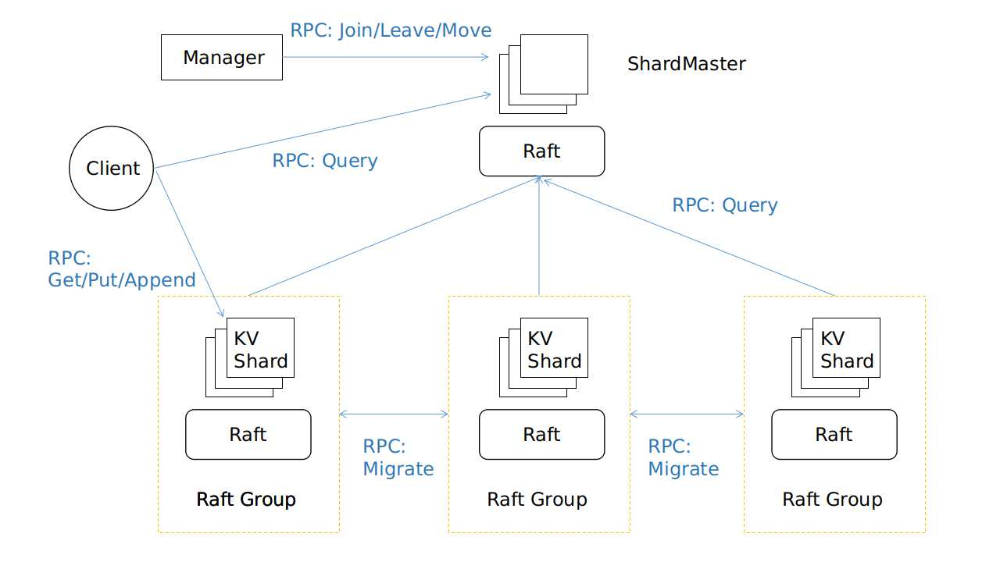

# 分布式分片KV存储系统

# Sharded Distributed KV Storage

## 实现功能

- 存储系统支持`Get` 、`Put`、`Append` 三种操作
- 包含一个基于 **Raft** 容错的 **ShardMaster** ， 以及几个 **Raft Group**
- 数据分片存储于 **Raft Group** 的复制状态机
- **ShardMaster** 用于添加、删除 **Raft Group** 以及在 **Raft Group** 之间移动数据分片
- **Client** 访问 **ShardMaster** 获得 *key* 所在的 **Raft Group** ；访问 **Raft Group** 中的 *leader* 执行读取和修改数据的操作
- **Raft** 实现：
  - 领导人选举
  - 日志同步
  - 通过快照加速故障恢复

## 架构

## Raft论文及研读笔记

[Raft 论文](https://github.com/XutongLi/Learning-Notes/blob/master/Distributed_System/Paper_Reading/Raft/raft-extended.pdf)

[Raft 研读笔记](https://www.cnblogs.com/brianleelxt/p/13251540.html)

